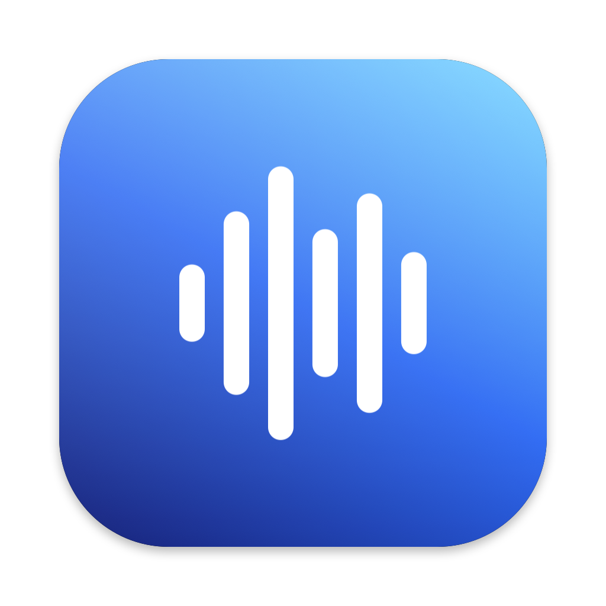

<p align="center"></p>

<h1 align="center">OpenNotch</h1>

<p align="center">Voice for your whole Mac. Hold a key to dictate anywhere, or tell your computer what to do.<br>
Lives in the notch. Runs on-device by default. Free and open source.</p>

---

## What it does

- **Dictation, anywhere.** Hold <kbd>fn</kbd> and talk. Release, and clean text appears at your cursor, with fillers removed, self-corrections applied ("Tuesday… actually no, Thursday" → "Thursday") and stutters gone.
- **Commands.** Hold <kbd>right ⌥</kbd> and say *"open Slack"*, *"click Send"*, *"File, export as PDF"*, *"turn the volume down"*, *"make this more formal"* (rewrites your selection), *"search for flights to Lisbon"*, or ask a question. Consequential actions ("send", "delete", "buy") pause on a confirmation card in the notch first.
- **Multi-step tasks, fast.** "Open Safari and search for flights to Lisbon" runs as a loop: each step the frontmost
  window becomes a table of controls and one Jev call picks the next operation and its target (a native take on
  Browser Use's [jev-ultrafast](https://github.com/browser-use/jev-ultrafast), for every app, not just the browser).
- **Decides while you talk.** Partial transcripts are routed in the background, so a finished command runs instantly,
  and a confident "open …" launches the app before you let go.
- **Fill forms from your clipboard.** Copy a resume, open an application form, and say "fill this out with what I copied".
- **The notch is the UI.** A Dynamic-Island-style panel shows a live waveform and transcript, then the result. On Macs without a notch it hangs from the menu bar.

## Why it's fast and cheap

Most voice agents send everything to a big LLM. OpenNotch splits the work into three tiers and uses the cheapest one that can do the job:

| Tier | Job | Default | Cost |
|---|---|---|---|
| **Hear** | Speech → text | NVIDIA **Parakeet** on the Neural Engine via [FluidAudio](https://github.com/FluidInference/FluidAudio), ~100× real time. Apple `SpeechAnalyzer` while it downloads. | Free, on-device |
| **Clean** | Remove fillers, apply self-corrections, spoken formatting, custom spellings | Instant rules, then a fast instruction-following model: Groq `gpt-oss-20b`, Cerebras, Claude Haiku, or a local 8B+ model via Ollama | ~$0.075 / M tokens on Groq (free tier available) |
| **Decide** | Which intent, which app, which button or menu item, is this risky? | [Jev](https://docs.typesafe.ai) via Vercel AI Gateway (or TypeSafe, or Pro), then Claude, then on-device | ~$0.042 / M input tokens, output free |
| **Write** | Rewrite selections, answer questions, plan multi-step tasks | Groq / Cerebras / Claude / local | Fractions of a cent |

Dictation follows what the popular open-source dictation apps (Handy, OpenWhispr, VoiceInk) converged on: Parakeet
for speech, then a cleanup model told to *fix, never rewrite*, with the transcript fenced off so dictated sentences
can't act as instructions. Small (~3B) models summarize instead of cleaning, so Apple's on-device model is opt-in only.

The key idea: **decisions aren't generation.** Picking "the Send button" out of 250 on-screen controls is a classification problem, so it goes to a model that returns a typed, calibrated choice in one parallel call. It never needs to write a paragraph first. Calibrated confidence also drives the UX: high confidence runs immediately; lower confidence asks first.

Other speed tricks:
- The screen is read (through the Accessibility tree, not screenshots) *while you're still talking*, so it adds no latency.
- The speech model stays resident between utterances.
- Short, clean dictation ("sounds good") skips the cleanup model entirely; the rules pass takes under 10 ms.
- Text is inserted by paste, restoring your clipboard afterward.

## Requirements

- macOS 26 (Tahoe) or later, Apple silicon
- Xcode (for the full build with Parakeet and Sparkle). Command Line Tools alone build a reduced app.
- Optional keys: Groq or Cerebras (dictation cleanup), Jev (command decisions), Anthropic; or a local Ollama / LM Studio server

## Build and run

```bash
scripts/build.sh run
```

That builds with SwiftPM, bundles `OpenNotch.app` into `~/Library/Caches/opennotch-build/` (outside cloud-synced
folders, which break code signatures), signs it, and launches it. If SwiftPM isn't usable it falls back to plain
`swiftc`, without Parakeet. First launch opens the welcome tour: permissions, the speech model download, a key test,
a live dictation test with your words-per-minute, and a command test.

**Permissions survive rebuilds only with a stable signature:**

```bash
OPENNOTCH_SIGN_IDENTITY="Developer ID Application: Name (TEAMID)" scripts/build.sh run
```

Releases (signing, notarization, DMG, Sparkle auto-updates, CI) are covered in [docs/RELEASING.md](docs/RELEASING.md).

## Try the pipeline without a microphone

```bash
B=~/Library/Caches/opennotch-build/OpenNotch.app/Contents/MacOS/OpenNotch
$B --say "open calculator"          # macOS `say` → on-device speech-to-text → router (never executes)
$B --route "click the send button"  # what would this command do, how confident, how fast
$B --polish "um so we should uh ship it Tuesday, actually no, Friday"
$B --agent-step "open Calculator and compute 12 times 8"   # the loop's next step for the frontmost window
$B --preview-onboarding paywall     # open one onboarding screen for design review
```

Set `OPENNOTCH_DEBUG=1` to see why a model step fell back. Keys can come from the environment (`AI_GATEWAY_API_KEY` for Jev, `GROQ_API_KEY`, `CEREBRAS_API_KEY`, `TYPESAFE_API_KEY`, `ANTHROPIC_API_KEY`, `OPENAI_API_KEY`) or from Settings, which stores them in the Keychain.

## Project layout

```
Sources/OpenNotch/
  App/            entry point, menu bar, orchestration, settings, updater, dev CLI
  Audio/          microphone capture + level metering
  Speech/         Parakeet (FluidAudio) and Apple SpeechAnalyzer engines
  Input/          global hold-to-talk keys (CGEventTap)
  Output/         paste-at-cursor with clipboard restore
  Intelligence/   Decider (Jev | on-device), TextModel (Groq | Cerebras | Claude | OpenAI-compatible | on-device), dictation cleanup
  Agent/          intents, Accessibility tree reading/clicking, router, multi-step plans
  UI/             notch panel, settings, onboarding (SwiftUI + Liquid Glass)
```

Renaming the product is a one-line change in `Brand.name` (`UI/Onboarding/Onboarding.swift`), plus `Resources/Info.plist`.

## Roadmap

- [ ] Hands-free mode (double-tap to lock recording)
- [ ] Integrations: MCP servers as command targets (Gmail, Calendar, Slack, Linear…)
- [ ] Per-app dictation styles and a personal dictionary learned from corrections
- [ ] History with search, and undo for the last command
- [ ] Local open-weight decider (a Jev-compatible typed-choice model) for fully offline, calibrated routing
- [x] Notarized DMG releases and Sparkle auto-update

## Privacy

Audio is transcribed on your Mac and never recorded to disk. With the default (on-device) settings nothing leaves your computer. If you choose cloud models, only what each request needs goes to the providers you picked: the text of a command and the names of on-screen controls (for decisions), and the text being cleaned up or rewritten (for writing).

## License

MIT. See [LICENSE](LICENSE).

## Acknowledgements

- [FluidAudio](https://github.com/FluidInference/FluidAudio) (Apache-2.0) runs Parakeet on the Apple Neural Engine.
- Speech models: [parakeet-tdt-0.6b-v3](https://huggingface.co/nvidia/parakeet-tdt-0.6b-v3) by NVIDIA and
  [parakeet-ultra](https://huggingface.co/moondream/parakeet-ultra) by Moondream, both CC-BY-4.0. They're downloaded on first use, not bundled.
- [Sparkle](https://sparkle-project.org) (MIT) delivers updates.
- The multi-step loop follows the design of [jev-ultrafast](https://github.com/browser-use/jev-ultrafast) by Browser Use (MIT).
- The dictation cleanup approach draws on public docs and discussions from [Handy](https://github.com/cjpais/Handy) and
  [OpenWhispr](https://github.com/OpenWhispr/openwhispr).
